# Parcial: Sistema de Control Académico

**Estudiante:** Josue Orellana
**Curso:** Desarrollo de Software
**Fecha:** 5 de marzo de 2026

## 1. Control de Versiones (Git)
Se utilizó la terminal MINGW64 para gestionar el repositorio. A continuación se muestra el flujo de trabajo realizado:

* **Inicialización y primer commit:**
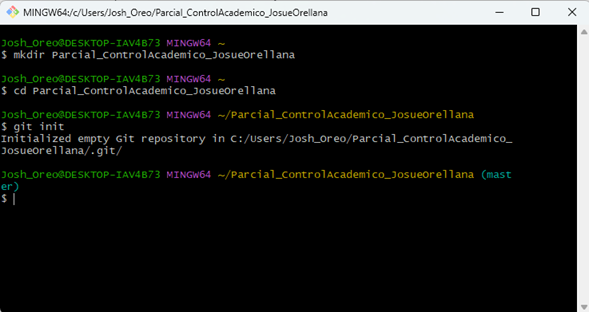
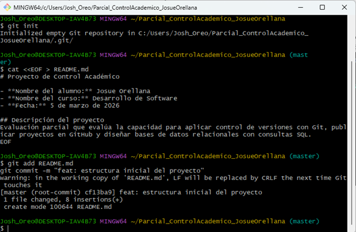

* **Conexión remota y primer push:**
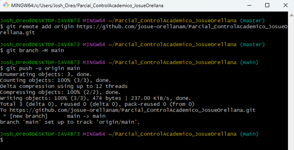

* **Actualización de estructura y documentación:**
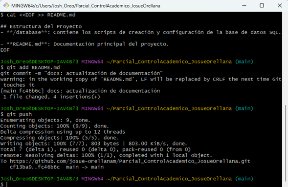

* **Cierre de entregas y push finales:**
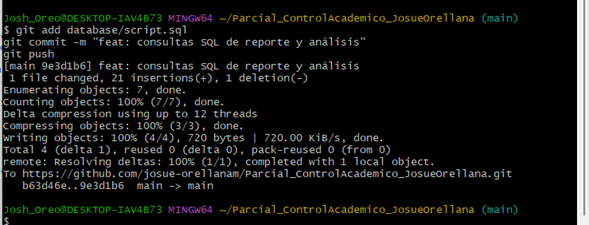
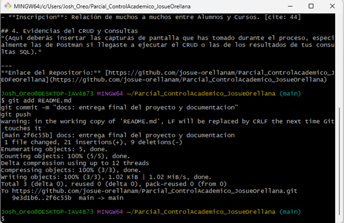

## 2. Base de Datos (PostgreSQL)
Se implementó el diseño físico en PostgreSQL 17.

* **Scripts de creación y población de datos:**
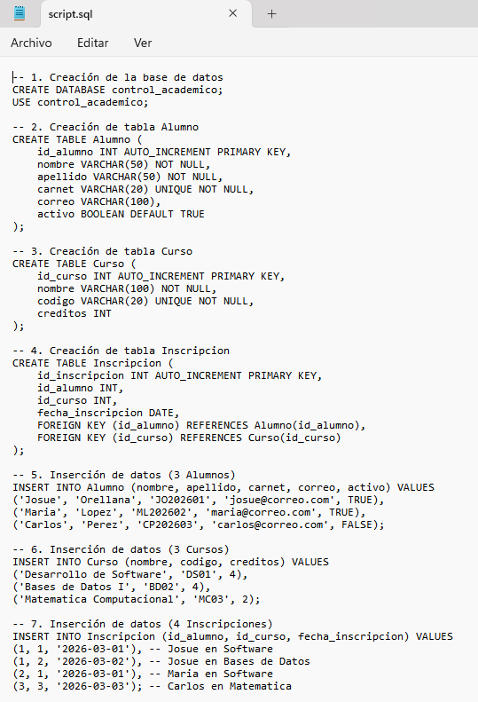
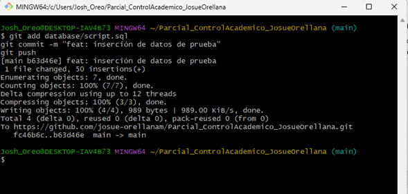

* **Lógica de Consultas (JOIN y GROUP BY):**
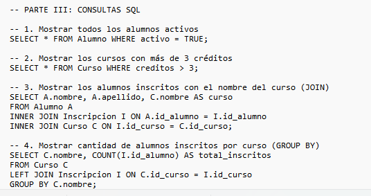

### Resultados en el DBMS
* **Relación Alumnos-Cursos (JOIN):**
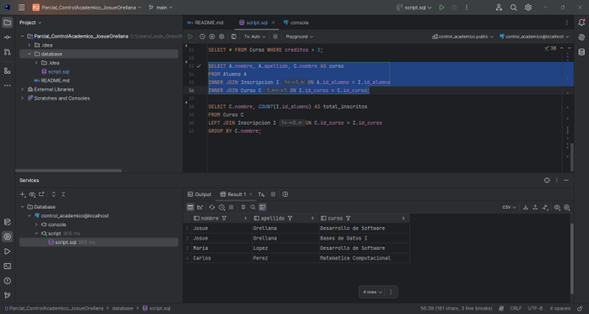

* **Análisis de inscritos (GROUP BY):**
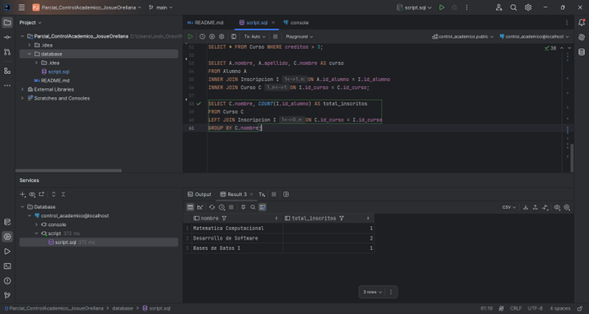

* **Verificación final del CRUD:**
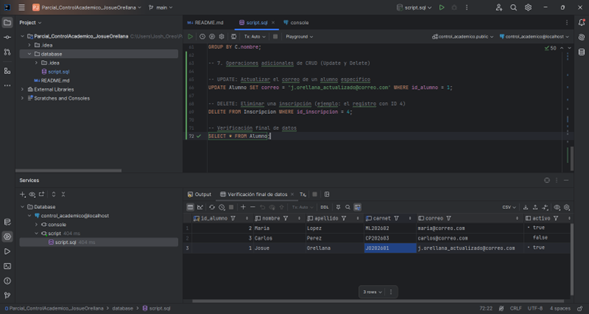

## 3. Pruebas de API (Postman)
Se validó la estructura de intercambio de datos mediante Postman.

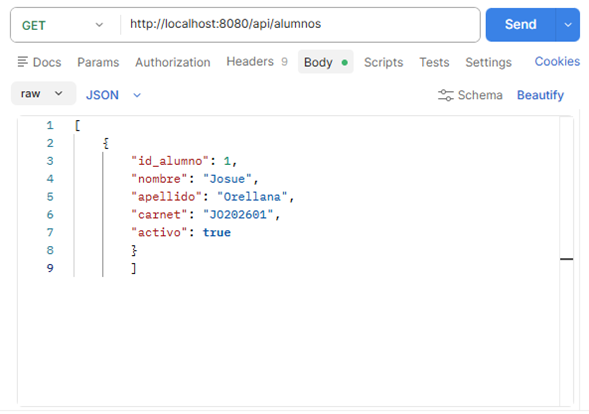

---
**Enlace al Repositorio:** [https://github.com/josue-orellanam/Parcial_ControlAcademico_JosueOrellana](https://github.com/josue-orellanam/Parcial_ControlAcademico_JosueOrellana)